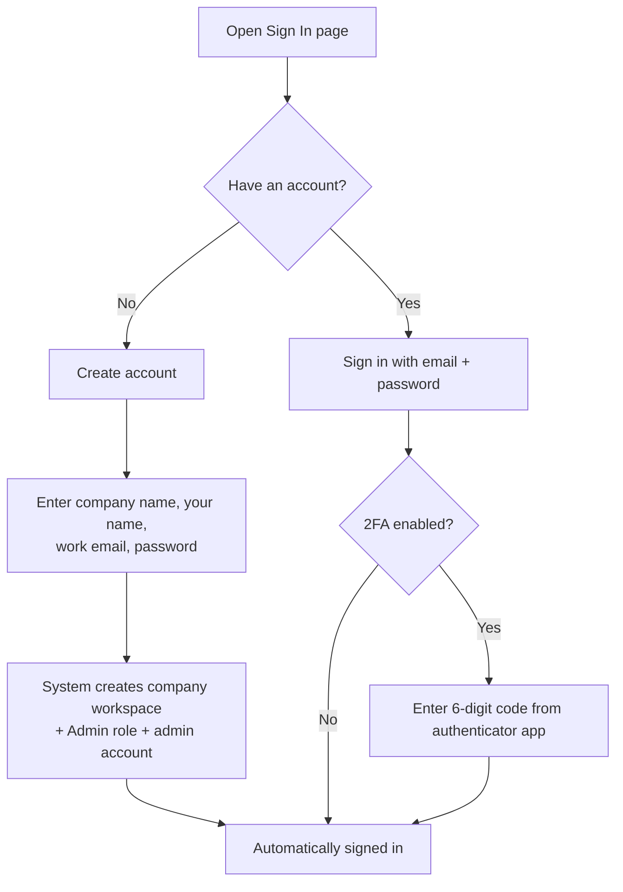
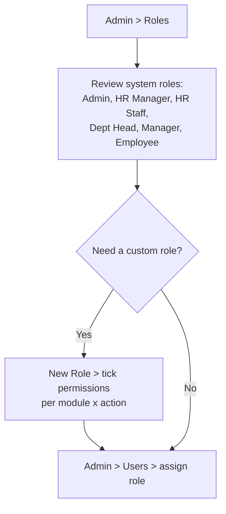
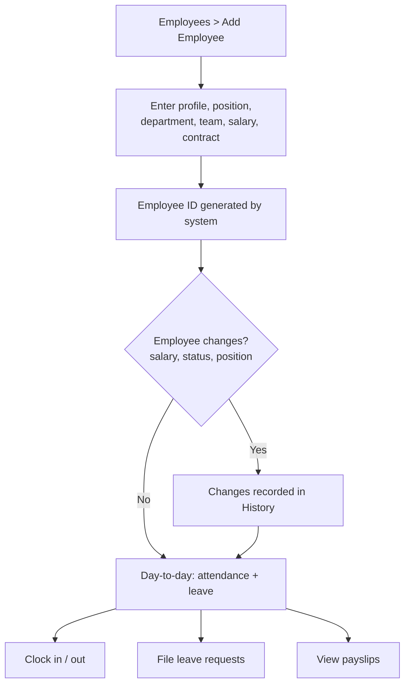
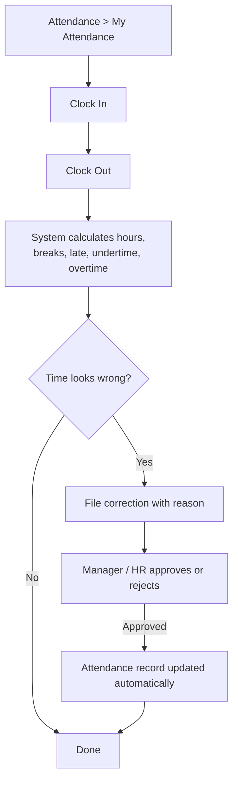
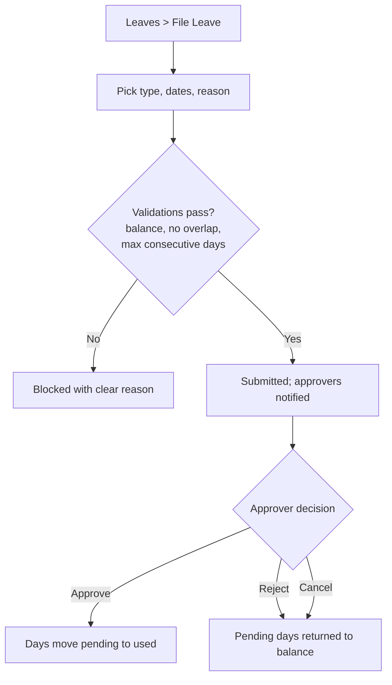
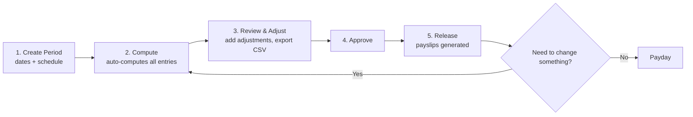

# HRM SaaS — User Flows

Version 1.0 · A client-facing walkthrough of how the product is used, day 0 to every payday.

---

## Where to Start

Think of the product in four phases:

| Phase | Who | Goal |
|---|---|---|
| 1. **Onboarding** | Company admin | Create the company workspace and admin account |
| 2. **Setup** | Admin + HR | Configure roles, departments, teams, shifts, leave types, payroll tables |
| 3. **Daily Operations** | Everyone | Employees clock in/out and file leaves; HR manages attendance, corrections, requests |
| 4. **Payroll Cycle** | HR + Finance | Compute, approve, and release payroll every period |

---

## 1. Onboarding (Day 0)

**Result:** The client now has an isolated company workspace. Nothing they do is ever visible to another company (data is isolated at the database level).

---

## 2. Setup (Week 1)

### 2.1 Configure Roles & Users

### 2.2 Structure the Company

### 2.3 Configure the Rules

| Task | Where | What to set |
|---|---|---|
| Shifts | Attendance → Shifts | Start/end time, break window, flexible toggle |
| Leave types | Leaves → Leave Types | Paid/unpaid, max days/year, monthly accrual, max consecutive days |
| Holidays | Holidays | Regular / special (non-working), recurring yearly |
| Government tables | Payroll → Contribution Tables / Tax Brackets | SSS, PhilHealth, Pag-IBIG, BIR tax brackets |
| Payroll settings | Payroll → Settings | Semi-monthly or monthly schedule |

> **Tip for the client:** system roles (Admin, HR, Employee, …) are pre-built and locked. Most companies never need a custom role — permissions can be adjusted per role as needed.

---

## 3. Employee Lifecycle

---

## 4. Daily Operations

### 4.1 Attendance (Employee)

### 4.2 Leave (Employee + Approver)

### 4.3 Notifications

Every important event notifies the right person in real time:

| Event | Who gets notified |
|---|---|
| Leave request filed | Approvers |
| Leave approved / rejected | The employee |
| Attendance correction filed | Approvers |
| Correction reviewed | The employee |

---

## 5. The Payroll Cycle (Every Period)

What **Compute** does automatically:

- Basic pay per active employee
- Overtime, night differential, holiday pay
- SSS / PhilHealth / Pag-IBIG deductions
- Withholding tax (BIR brackets)
- Active loan deductions
- **Net pay** per employee

Basic pay follows the period schedule:

- **Monthly-salaried** employees get a fixed amount per period — full monthly salary for a monthly period, **half for semi-monthly** — prorated for mid-period hires/leavers. Attendance drives OT, night-diff, and holiday pay, not the base salary.
- **Daily-rate** employees are paid per day worked (`daily rate × days worked`).
- Monthly SSS / PhilHealth / Pag-IBIG and withholding tax are split across the period's checks, so deductions are correct on semi-monthly payouts too.

On **Release**, every employee gets a payslip (PDF). Loans and adjustments are reflected automatically. A computed period can be reverted to draft at any time if the data needs to change before approval.

---

## 6. Roles at a Glance

| Role | What they can do |
|---|---|
| **Admin** | Everything — roles, users, settings, payroll |
| **HR Manager** | HR operations + payroll approval |
| **HR Staff** | Employee, attendance, leave processing |
| **Department Head** | Department-scoped management |
| **Manager** | Team-scoped management (no payroll/roles/users) |
| **Employee** | Clock in/out, file leaves, view own payslips |

The UI adapts: the sidebar shows only pages your role can read, and buttons only appear when your role allows the action. The API enforces the same rules (`403 Forbidden` otherwise).

---

## Suggested Demo Script

1. **Create a company** (2 min) — shows how fast onboarding is.
2. **Add a department, team, and 2–3 employees** (3 min) — shows the org structure.
3. **Create a shift and a leave type** (2 min) — shows configurability.
4. **Log in as an employee** → clock in/out, file a leave (3 min) — shows self-service.
5. **Log in as HR** → approve the leave, review attendance, create a payroll period and **Compute** (3 min) — shows the approval loop and the payroll engine.
6. **Release the period** → show a generated payslip (2 min) — closes the loop with a tangible deliverable.
